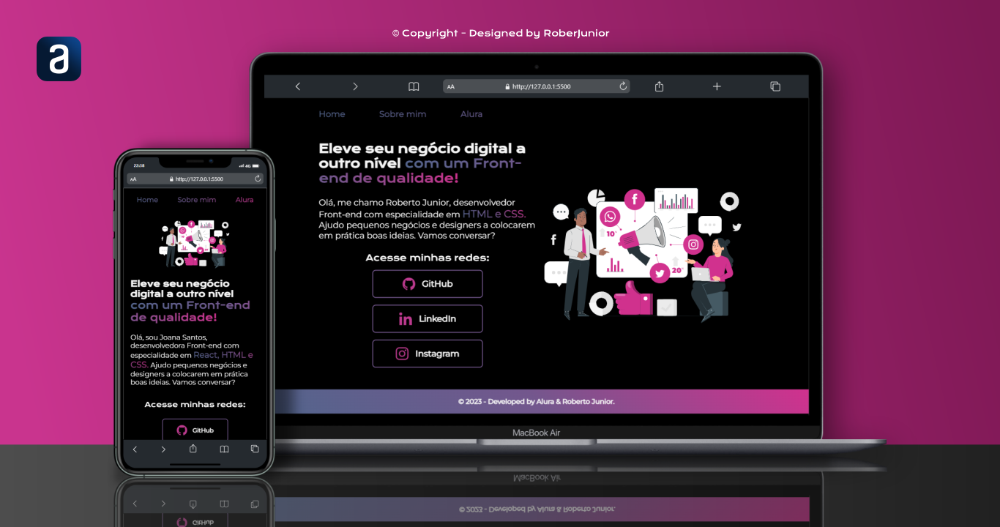

<h1 align="center"> Projeto Portfolio Alura </h1>

Este é o 1º projeto que faz parte da Formação Front End da Platafroma Alura, apresentado por Guilherme Lima, Rafaella Ballerini e Monica Hillman. 

  <a href="#-tecnologias">Tecnologias</a>&nbsp;&nbsp;&nbsp;|&nbsp;&nbsp;&nbsp;
  <a href="#-projeto">Projeto</a>&nbsp;&nbsp;&nbsp;|&nbsp;&nbsp;&nbsp;
  <a href="#-layout">Layout</a>&nbsp;&nbsp;&nbsp;|&nbsp;&nbsp;&nbsp;
  <a href="#memo-licença">Licença</a>

  

 

  

    
  

 
 

 
🧑‍🚀 A idéia deste projeto foi disponibilizada no curso de formação Front End "A partir do zero: Html, Css para projetos web", contendo 6 módulos e um total de 51 horas apresentado por Guilherme Lima, Rafaella Ballerini e Monica Hillman ❤️‍🔥.

## 🚀 Tecnologias

Esse projeto está sendo desenvolvido com as seguintes tecnologias:

<li> HTML
<li> CSS
<li> Figma
<li> Git and GitHub

## 💻 Projeto

Minha intenção em compartilhar, é que tenha aqui disponível um formato simples, responsivo e otimizado de portfólio para quem esttá iniciando em desenvolvimento web como Eu, e para ver o estado atual que está o projeto basta<a href="https://robertojunnior.github.io/alura-portfolio/"> CLICAR AQUI.</a>🚀

<!-- [Visite o projeto online](https://robertojunnior.github.io/alura/portfolio-alura/) -->

## 🔖 Layout
Este projeto do FIGMA foi desenvolvido por ALURA. 

## :memo: Licença

Este projeto está sob a licença MIT.
 

Para adquirir a imagem SVG da tela inicial do projeto basta, acessar o link a seguir: <a href="https://storyset.com/business">Business illustrations by Storyset</a>
  A imagem é gratuita com atribuição.

---

Feito ❤️‍ by Roberto Junior 😁:wave: 
 🧑‍🚀[Inscreva-se no canal do YouTube da Alura!](https://www.youtube.com/@Alura)

    
<h4> Obrigado por visitar meu Git e se chegou até aqui dê um "FOLLOW" que retribuo, quem sabe não podemos colaborar em algum projeto juntos?
   
   

 Até a próxima! 😁🖖.
